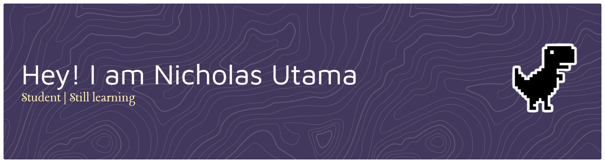

<!-- ## Hi there! I'm Nicholas Utama 👋 -->

:mortar_board: Computer Science Student at Binus University
:fire: Passionate about Cloud, Cybersecurity, and Tech Innovation
:books: Always learning and improving

--- 
### :globe_with_meridians: Connect With Me

 

---
### :gear: Skills
               

---

<picture>
  <source media="(prefers-color-scheme: dark)" srcset="https://raw.githubusercontent.com/Nicholas3/Nicholas3/output/pacman-contribution-graph-dark.svg">
  <source media="(prefers-color-scheme: light)" srcset="https://raw.githubusercontent.com/Nicholas3/Nicholas3/output/pacman-contribution-graph.svg">
  
</picture>

